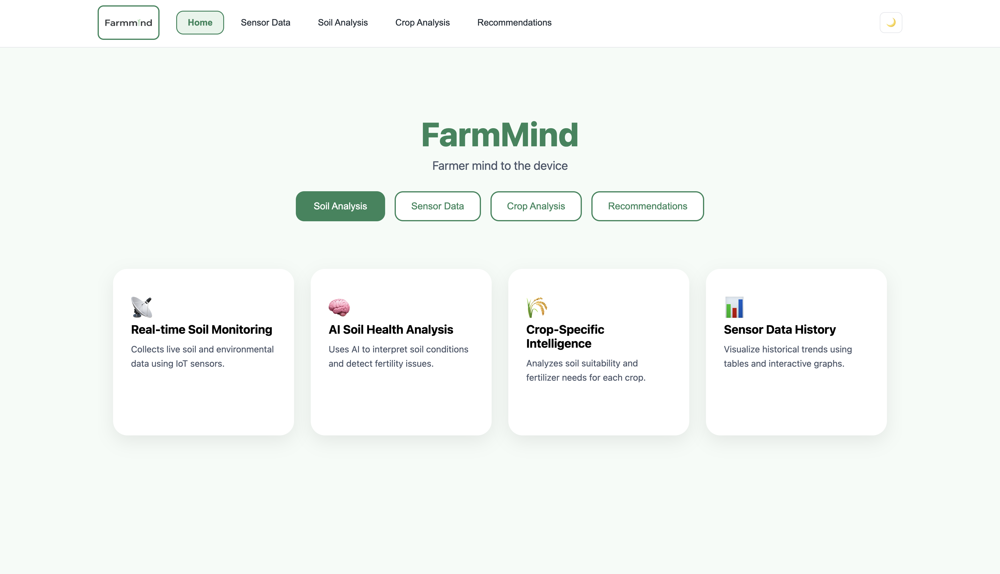

  

<h1 align="center">Hi 👋, I'm Raj Singh</h1>
<h3 align="center">
Full Stack Developer • MERN Stack Developer • MCA Student at BHU
</h3>

---

# 👨‍💻 About Me

🎓 MCA Student at Banaras Hindu University  
💻 Full Stack Developer focused on MERN Stack applications  
🚀 Building scalable web applications & real-world projects  
🌱 Currently learning Backend Engineering & System Design  
📚 Solved 120+ DSA problems on LeetCode (Java)  
⚡ Interested in IoT, APIs, Automation & Full Stack Development

---

# 🚀 Featured Projects

## 🌾 [FarmMind](https://github.com/therajsingh/farmmind-backend)
An IoT + AI powered agriculture platform integrating ESP32 hardware with MERN stack applications for smart farming insights.

### Live Demo
🚀 https://farmmind-frontend.vercel.app/

### Features
- Real-time soil monitoring
- AI-generated crop recommendations
- Sensor data analytics
- Cloud deployment

### Tech Stack
`React.js` `Node.js` `Express.js` `MongoDB` `ESP32` `LLM APIs`

  

---

## ✈️ [WanderLust](https://github.com/therajsingh/wanderlust)
A full-stack travel listing and accommodation booking platform inspired by Airbnb.

### Live Demo
🚀 https://wanderlust-m7md.onrender.com/listings

### Features
- Authentication & Authorization
- Property Listings
- Image Uploads
- Reviews & Ratings
- Responsive Design

### Tech Stack
`Node.js` `Express.js` `MongoDB` `EJS` `Cloudinary` `Passport.js`

  

---

## ▶️ [React-YT](https://github.com/therajsingh/react-yt)
A dedicated React.js practice repository where I continuously build and experiment with modern React concepts while improving frontend development skills.

### What I Practice
- React Components & Props
- State Management & Hooks
- Routing & API Integration
- Responsive UI Design
- Reusable Component Architecture

### Tech Stack
`React.js` `JavaScript` `CSS` `Vite`

---

# 🛠️ Tech Stack

### Languages

### Frontend

### Backend & Database

### Tools & Platforms

---

# 📊 GitHub Stats

  
  &nbsp;&nbsp;

# 📊 LeetCode Stats
  

---

# 📚 Currently Exploring

- Backend System Design
- Scalable MERN Architectures
- API Security & Authentication
- Advanced Data Structures & Algorithms
- Real-Time Applications with Socket.IO

---

# 🌐 Connect With Me

📧 developer.rajsingh@gmail.com

---

# ⚡ Fun Fact

I enjoy building practical software solutions, solving DSA problems, and continuously improving my development skills 🚀

---

⭐️ From [therajsingh](https://github.com/therajsingh)
